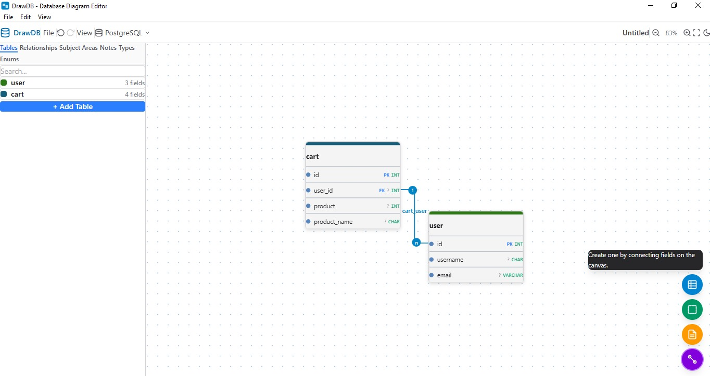
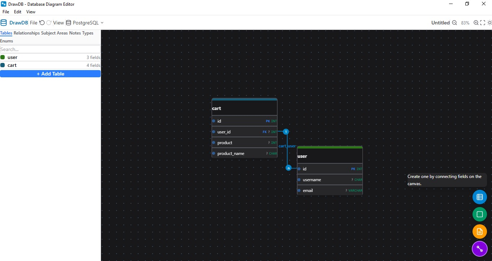

# DrawDB Desktop


A cross-platform desktop application for drawing database diagrams — design tables, relationships, and schemas visually, then export production SQL. Built with [Tauri 2](https://tauri.app) and [SvelteKit](https://svelte.dev).

## Download

Grab the installer for your OS from the **[Releases page](https://github.com/rainman456/drawdb-desktop/releases/latest)**:

| OS | File |
|----|------|
| Windows (x64) | `DrawDB_1.0.0_x64-setup.exe` |
| macOS (Intel) | `DrawDB_1.0.0_x64.dmg` |
| Linux (Debian/Ubuntu) | `DrawDB_1.0.0_amd64.deb` |
| Linux (Fedora/RHEL) | `DrawDB-1.0.0-1.x86_64.rpm` |
| Linux (any, portable) | `DrawDB_1.0.0_amd64.AppImage` |

> **Windows SmartScreen / Defender:** the installer is unsigned, so Windows may block it silently. If nothing happens when you double-click it, open **Windows Security → Virus & threat protection → Protection history**, allow the file, or right-click the `.exe` → **Properties** → check **Unblock**.

## Demo

<p align="center">
  <video src="demo/demo.webm" controls width="800"></video>
</p>

_Walkthrough of the Windows build: creating tables, connecting `cart.user_id` → `user.id` by dragging a field's grip dot, and editing cardinality._

> If the video doesn't play inline, [open it directly](demo/demo.webm) or download it.

## Screenshots

<p align="center">
  
</p>

<p align="center">
  
</p>

Same diagram in **light** and **dark** themes: `cart.user_id` → `user.id` created by dragging the field grip dot (FK badge, `1..n` cardinality, relationship mode hint on the right).

## Features

- Visual canvas with drag, pan, and zoom — tables, relationships, areas, and notes
- Cardinality and foreign-key constraint editing (1:1, 1:N, N:1, ON DELETE/UPDATE rules)
- Custom types and enums with per-database support (MySQL, PostgreSQL, SQLite, …)
- Export to **SQL**, **JSON**, **PNG**, **SVG**, and **PDF**
- Import existing diagrams, save and reopen them locally
- Light and dark themes, snap-to-grid, keyboard shortcuts
- Native OS menu bar (File / Edit / View) mirroring the in-app controls

## Setup

### Prerequisites

**All platforms**
- [Bun](https://bun.sh) 1.0+
- [Rust stable toolchain](https://rustup.rs)

**Windows**
- Visual Studio C++ Build Tools (with “Desktop development with C++”)
- WebView2 runtime (pre-installed on Windows 10 1803+ and Windows 11)

**macOS**
```bash
xcode-select --install
```

**Linux (Debian/Ubuntu)**
```bash
sudo apt update
sudo apt install -y libwebkit2gtk-4.1-dev libappindicator3-dev librsvg2-dev patchelf libgtk-3-dev
```

### Install

```bash
git clone https://github.com/rainman456/drawdb-desktop.git
cd drawdb-desktop
bun install
```

The Tauri CLI ships as a dev dependency — no global install needed.

### Run (development)

```bash
bun run tauri:dev
```

Starts the Vite dev server and opens the desktop window with hot reload. Svelte changes reload instantly; Rust changes trigger a recompile.

Frontend only (plain browser preview, no native menus/file system):

```bash
bun run dev
```

### Build (production)

```bash
bun run tauri:build
```

Installers land in `src-tauri/target/release/bundle/`:

| Platform | Output |
|----------|--------|
| Windows | `nsis/DrawDB_1.0.0_x64-setup.exe` |
| macOS | `dmg/DrawDB_1.0.0_x64.dmg` |
| Linux | `deb/*.deb`, `rpm/*.rpm`, `appimage/*.AppImage` |

### Lint & test

```bash
bun run lint    # svelte-check (type checking)
bun run test    # bun test
```

See [BUILD_INSTRUCTIONS.md](BUILD_INSTRUCTIONS.md) for cross-compilation targets and advanced options, and [BUILD_GUIDE.md](BUILD_GUIDE.md) for the full CI/release runbook and a catalog of build errors with their fixes.

## Continuous integration

Every push to `main` runs **lint + tests**, then builds all three platforms in GitHub Actions. Pushing a `v*` tag additionally publishes a **draft release** with the installers attached to this repository — review it, then click **Publish release**. The workflow is documented in [BUILD_GUIDE.md](BUILD_GUIDE.md).

## Project structure

```
src/                    SvelteKit frontend (Svelte 5)
  lib/components/       Canvas, header, side panel, modals
  lib/stores/           State stores (diagram, transform, layout, …)
  lib/actions/          File open/save/export actions
src-tauri/              Rust shell (Tauri v2)
  capabilities/         Permission grants
  tauri.conf.json       App + bundle configuration
.github/workflows/      CI pipeline (lint, test, build, release)
```
